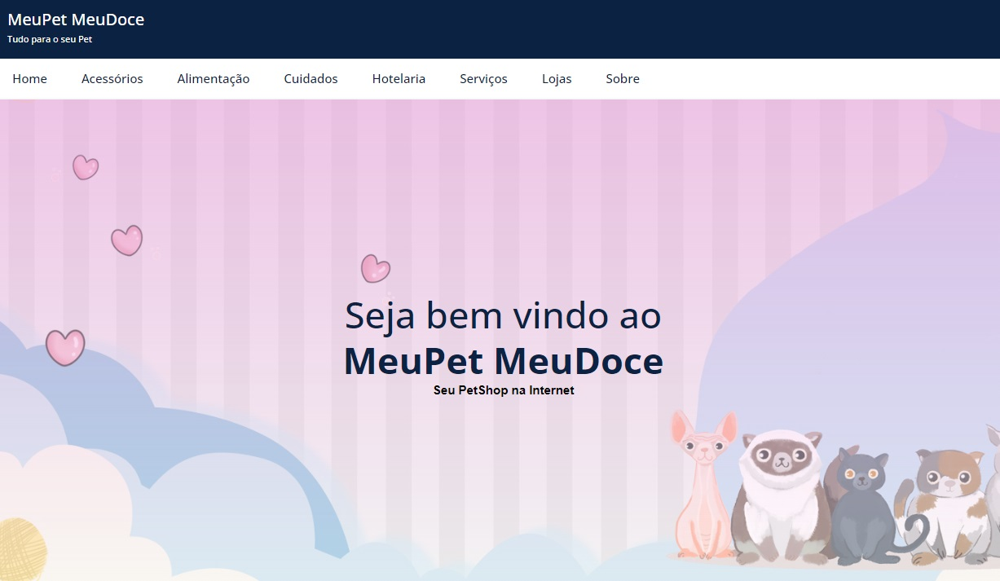

<h1 align="center">PUCRS | Fundamentos de Sistemas Web</h1>

<p align="center">
MeuPet MeuDoce - Plataforma online para PetShop. 
</p>

<p align="center">
  <a href="#-tecnologias">Tecnologias</a>&nbsp;&nbsp;&nbsp;|&nbsp;&nbsp;&nbsp;
  <a href="#-projeto">Projeto</a>&nbsp;&nbsp;&nbsp;|&nbsp;&nbsp;&nbsp;
  <a href="#-execução">Execução</a>&nbsp;&nbsp;&nbsp;|&nbsp;&nbsp;&nbsp;
  <a href="#memo-licença">Licença</a>
</p>

<br>

<p align="center">
  
</p>

## 🚀 Tecnologias

Esse projeto foi desenvolvido utilizando as seguintes tecnologias:

- HTML
- JavaScript
- CSS
- Git e Github

## 💻 Escopo do Projeto

O Projeto consiste na criação de uma plataforma online para um PetShop, abrangendo todas as fases de planejamento e desenvolvimento, conforme abordado durante as aulas.

A plataforma online é um sistema web de comércio de produtos e serviços para PetShop. Os produtos disponíveis para venda são ração seca e ração úmida, e o aluno tem a liberdade de escolher as opções de apresentação, desde que haja pelo menos duas opções de cada categoria. Quanto aos serviços, eles são divididos em banho e tosa, com categorias para animais de pequeno porte e de grande porte.

## 🔖 Execução

Utilize o link abaixo para visualizar site em execução:
https://thiagorpc.github.io/pucrs-fundamentos-web-projeto-parte02/

Para baixar os arquivos localmente:

```
git clone https://github.com/thiagorpc/pucrs-fundamentos-web-projeto-parte02.git
```

## 📝 Licença

Esse projeto está sob a licença MIT.
